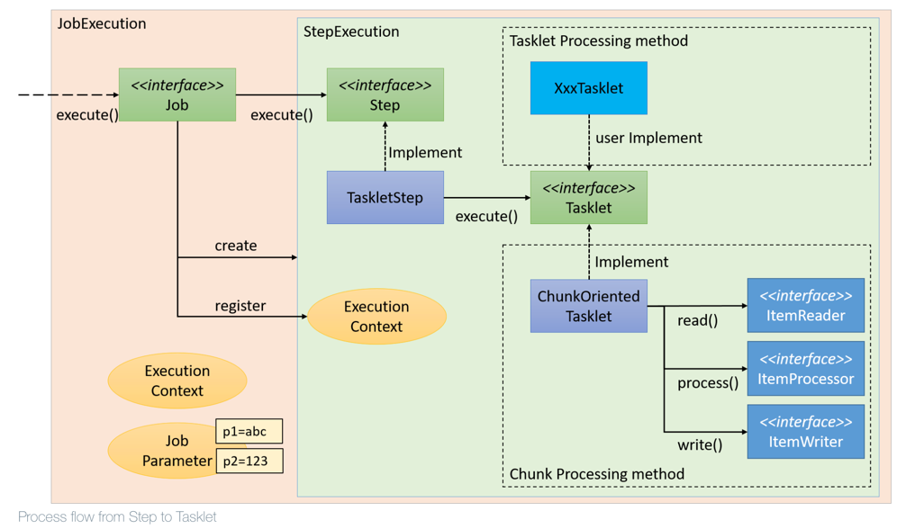
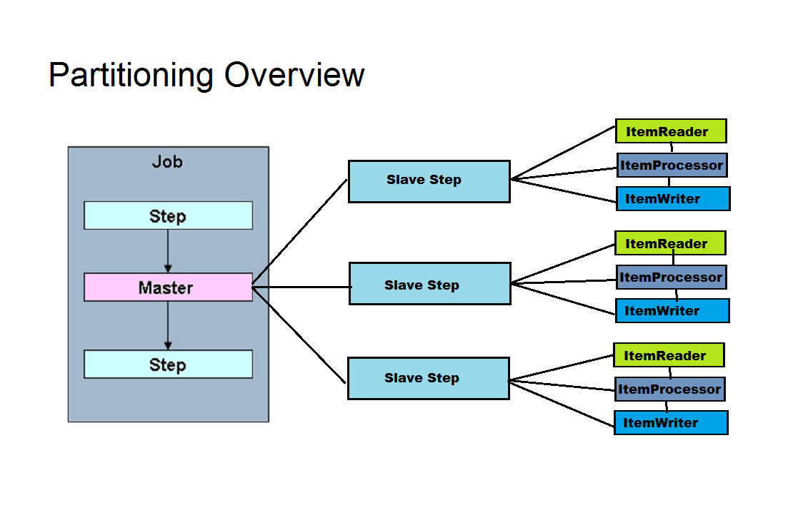
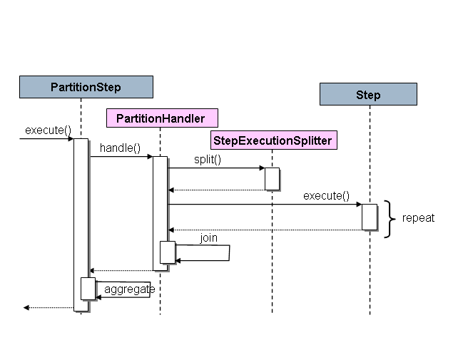
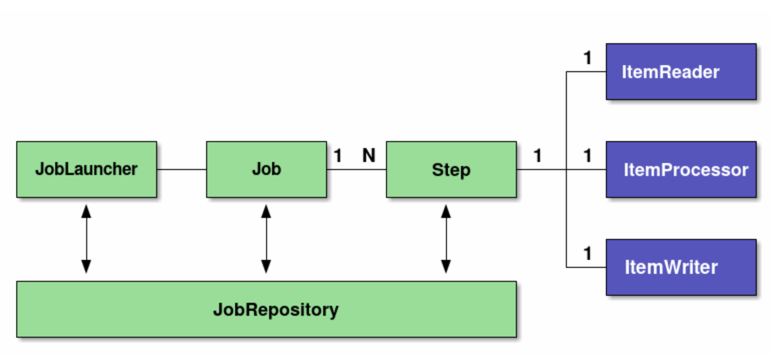
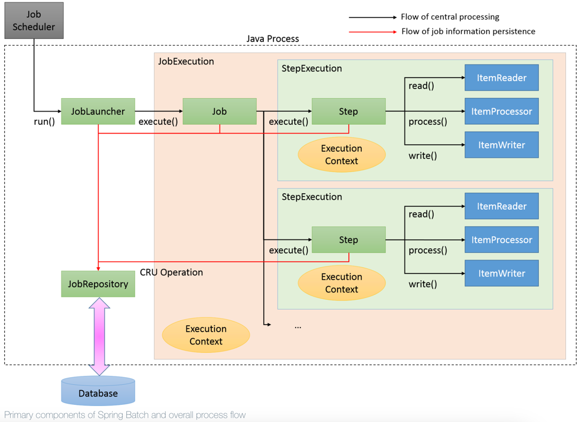

# spring-batch-file-processing

Sample project to play with processing large text files using Spring Batch

# Task description

The task of batch massive sequential data processing occurs in many enterprises: data migrations, data convertings, data transformations and so on.
Additionally, there could be a requirement to process data in less time and less resources, meaning the paginated 'read'
and parallel 'processing' / 'write' operations are used.

Here comes Spring framework with capabilities of creating batch jobs and  organizing read/process/write operations in parallel
pipelines. Spring Batch has enough ready-to-use implementations for Readers, Processors, and Writers, and provides flexible
customization capabilities.

# Spring Batch framework

Spring Batch is a processing framework for building reliable batch jobs. Spring Batch, as the name implies is a batch 
application framework. Following functions are offered based on DI container of Spring, AOP and transaction control function.

# Step

The step is a common term that is intended for handling 1 batch task. A job can have more than one step executing them one after another.

`Step` interface is a root for all the steps and the implementations are: `FlowStep`, `PartitionStep`, `JobStep`, `TaskletStep`.
The implementation of a Step defines a kind of task whether it is singe or repeated, transitioned, partitioned, chunked, or custom.

- TaskletStep works based on a `Tasklet`. A Tasklet runs only 1 task (single or possibly repeated), and each call surrounded
by a transaction. This kind of step is used more frequently because of its nature of transaction calls controlled on a Step level. 

A Tasklet can be customized/extended to run custom logic, and there are existing Tasklet implementations created for general-purpose tasks, 
such as ChunkOrientedTasklet implementing chunk-oriented variations on read-process-write handling.

* readers implement the `ItemReader` interface intended to read/retrieve/load data for further handling. There are many useful implementations: `FlatFileItemReader`, `JsonItemReader`, `JdbcPagingItemReader`, `MongoItemReader`;
* processors implement the `ItemProcessor` interface intended to process/transform/convert data: `CompositeItemProcessor`, `FunctionItemProcessor`, `ValidatingItemProcessor`;
* writers implement the `ItemWriter` interface intended to write/push/send data to some file/database/queue: `JsonFileItemWriter`, `FlatFileItemWriter`, `MultiResourceItemWriter`, `CompositeItemWriter`;

The diagram for TaskletStep that uses ChunkOrientedTasklet:

- PartitionStep divides the step execution on fixed number of partitions and spreads the load using a `PartitionHandler` (TaskExecutorPartitionHandler).
Every partition represents a single task that is running in parallel to other partitions.
The diagram for PartitionStep:

- FlowStep delegates its work to a `Flow`. It is useful for logical grouping of steps, and especially for partitioning 
with multiple steps per execution.

- JobStep delegates to a `Job` to do its work. It is useful for managing dependencies between jobs, and also to modularise
complex step logic into something that is testable in isolation.

A Step is tightly coupled to the `StepExecution` domain entity that represents a step execution with job execution, status,
read count, write count, start time, end time, exit status, and other properties.

A Step can be configured using the `StepBuilder`, which chooses an implementation at runtime looking at given params.

# Job

The `Job` is an abstraction to represent a multi-steps processing. Job contains multiple steps and runs step execution sequentially in a loop.
Any step that fails will fail the job. The job is considered complete when all steps have been executed.

A Job is tightly coupled to the `JobExecution` domain entity that represents a job execution with job params, status, 
exit status, start time, end time, and other properties.

A Job can be created using the `JobBuilder` with additional properties such as listener, incrementer, job repository, 
meter registry.

Here is a diagram of a Job that is using a TaskletStep (ChunkOrientedTasklet):

# JobRepository

Spring Batch follows the traditional batch architecture where a Job works of interacting with the JobRepository. Spring Batch
supports many features like restarting a failed batch, recording the status of the batch execution and so on. In order to
achieve that Spring uses a database schema to store the status of the registered jobs, the auto-configuration already provides
you the basic configuration of the required data source and it is this configuration that requires the relational database
configuration.

The JobRepository is used for basic CRUD operations of the various persisted domain objects within Spring Batch, such as
JobExecution and StepExecution. It is required by many of the major framework features, such as the JobLauncher, Job, and Step.

The diagram for how a Job is related to other components:

# TaskExecutor

[TODO]

# Bean scopes

StepScope 

The step scope is designed for beans that should be lazily instantiated at runtime when the step is executed. By default, for interface based beans, Spring will create JDK dynamic proxies, and for classes it will use CGLib.
A spring batch StepScope object is one which is unique to a specific step and not a singleton. As you probably know, the 
default bean scope in Spring is a singleton. 

But by specifying a spring batch component being StepScope means that Spring Batch will use the spring container to instantiate
a new instance of that component for each step execution.
This is often useful for doing parameter late binding where a parameter may be specified either at the StepContext or the
JobExecutionContext level and needs to be substituted for a placeholder, much like your example with the filename requirement.

Another useful reason to use StepScope is when you decide to reuse the same component in parallel steps. If the component
manages any internal state, its important that it be StepScope based so that one thread does not impair the state managed
by another thread (e.g, each thread of a given step has its own instance of the StepScope component).

JobScope

[TODO]

# Useful links

https://docs.spring.io/spring-batch/reference/index.html

https://www.baeldung.com/spring-batch-tasklet-chunk

https://github.com/spring-projects/spring-batch/tree/main/spring-batch-samples

https://levelup.gitconnected.com/10-handy-spring-batch-tricks-24556cf549a4?gi=c014466aa899
